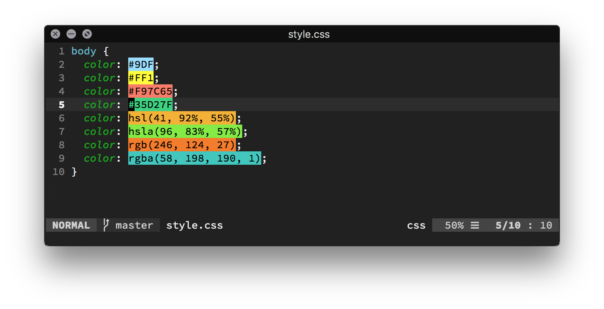

# Coloresque



## Color preview for Vim

### Overview

This is merge of [ap vim-css-color](https://github.com/ap/vim-css-color) and [colorizer](https://github.com/lilydjwg/colorizer).
The main goal was to fix cursorline [bug](https://github.com/skammer/vim-css-color/issues/12) and keep named colors(i.e. white, black, aqua). I ended up mixing both plugins plus wrote some stuff, so I decided to leave it as a separate plugin.

### Installation

Via [vim-plug](https://github.com/junegunn/vim-plug):

```
Plug 'junegunn/vim-plug'
```
